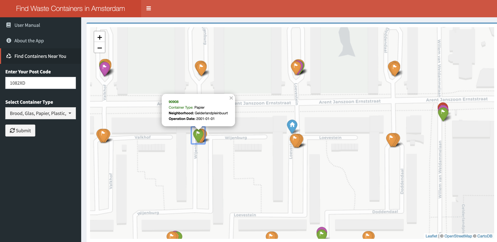

# Find Waste Containers in Amsterdam

[This Shiny App](https://lujiaw.shinyapps.io/find-waste-containers-in-amsterdam/) is designed for residents in Amsterdam to find nearby waste containers. By simply entering your post code, the map will show the nearest containers near your home.

Note: The leaflet map sometimes needs longer time to load.

## Reference

Amsterdam OIS Deparment: <https://data.amsterdam.nl/>

Waste Container API: https://api.data.amsterdam.nl/vsd/afvalcontainers/

BAG Data: <https://data.amsterdam.nl/datasets/CxSRcN9AhiPipQ/basisregistratie-adressen-en-gebouwen-bag/>

